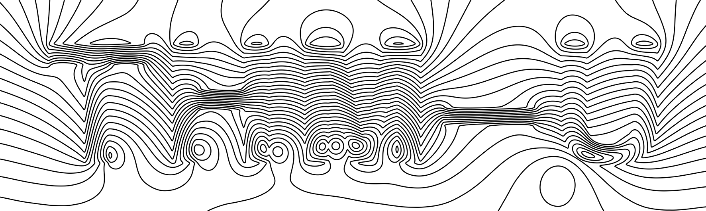

## THM2D-U

<p align="center">
  
</p>

The code in this repository calculates stresses and displacements in porous media induced by the fluid pressure and thermal expansion. It implements a finite volume solver to the problem of linear thermoporoelasticity. At the moment, fluid flow and heat conduction are uncoupled from elastic deformations, i.e. volume changes of the solid phase do not influence fluid pressure and rock properties such as porosity and permeability. Mass and energy balance of the fluid phase are computed by the [MUFITS reservoir simulator](http://www.mufits.imec.msu.ru/). This code consumes output files from MUFITS and solves for stresses and displacements of the rocks using provided pore pressure and temperature distributions.

This repository contains only procedures required to solve axisymmetric problems on structured meshes. That means that in the `GRID` section of the RUN file the `RADIAL` option must be used, and the `CARFIN` keyword is unsupported.
The code supports heterogeneous mechanical properties of the porous medium, i.e. the shear modulus, the drained bulk modulus, the bulk modulus of the solid grains and volumetric coefficient of thermal expansion can vary in space.

### Installation and usage

You can get THM2D-U using two options: by downloading the release or by getting the source code. To download the pre-built release, go to the `Releases` tab at the Github page of the project and choose an appropriate version for your OS. In that case, you can skip directly to the point 3 of the instructions.

The `master` branch of the repository contains the up-to-date version of the code. Downloading the code requires manual compilation of the command-line tool that converts MUFITS output files. To build the converter you'll need C99-compliant compiler. The simulation part of the code is written in MATLAB and requires only working MATLAB installation.

To access the latest version of the code, you need to either download the source code as an archive or clone the repository. If you decided to download the code as a .zip archive, skip the first point of the following instructions.

1. Clone the repository:
   ```
   > git clone https://github.com/utkinis/THM2D-U.git
   ```
2. Change the directory to `THMD-U/mufits2matlab/` and compile the converter:
   ```
   > cc mufits2matlab.c mufitsio.c -o mufits2matlab
   ```
3. To convert MUFITS .SUM files to .dat files, run the following command
   ```
   > ./mufits2matlab <sim-name> <path-to-sum-dir> <path-to-out-dir> <id-start> <id-end>
   ```
   Here `<sim-name>` is the name of the MUFITS simulation, e.g. if the RUN-file is named `CAMPI-FLEGREI-2D.RUN`, name of the simulation is `CAMPI-FLEGREI-2D`; `<path-to-sum-dir>` is a path to the directory containng .SUM files; `<path-to-out-dir>` is a path to the directory where .dat files will be stored; `<id-start>` and `<id-end>` are indices of the first and the last timestep that will be converted.
4. Run MATLAB and launch the script `THM2D_U.m`. Inside the script you might need to change path to the directory where you have stored .dat files, by default it points to the directory `input`. Also, the number of cells in r and z directions and cell size increments are also duplicated in `THM2D_U.m` and may require changing according to the chosen grid parameters in MUFITS.
